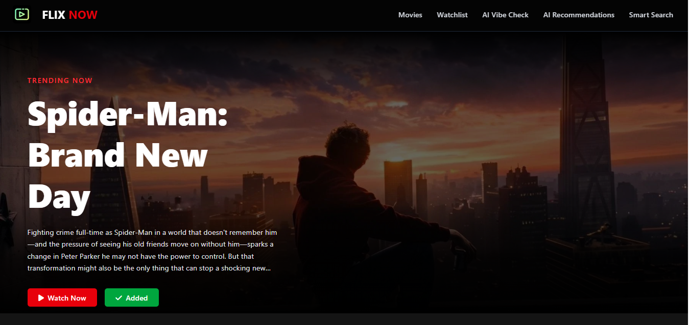
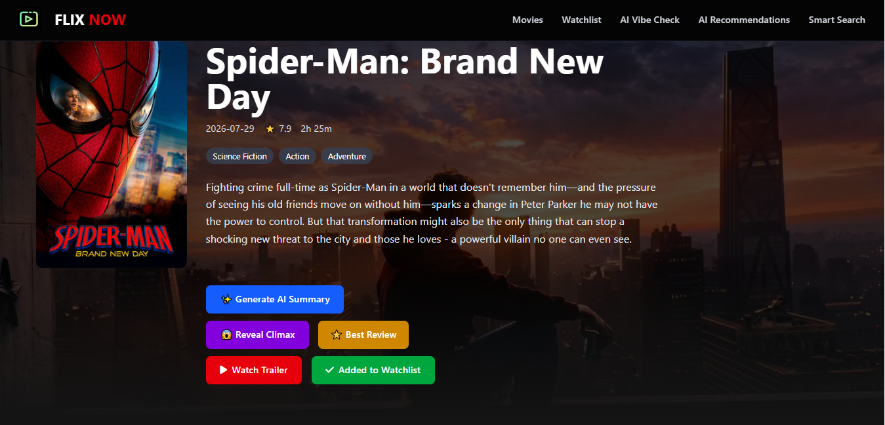
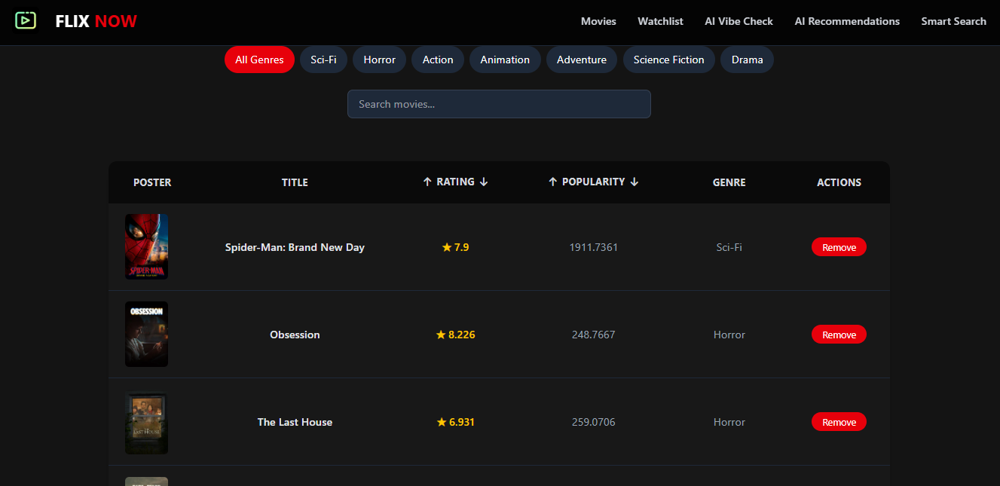
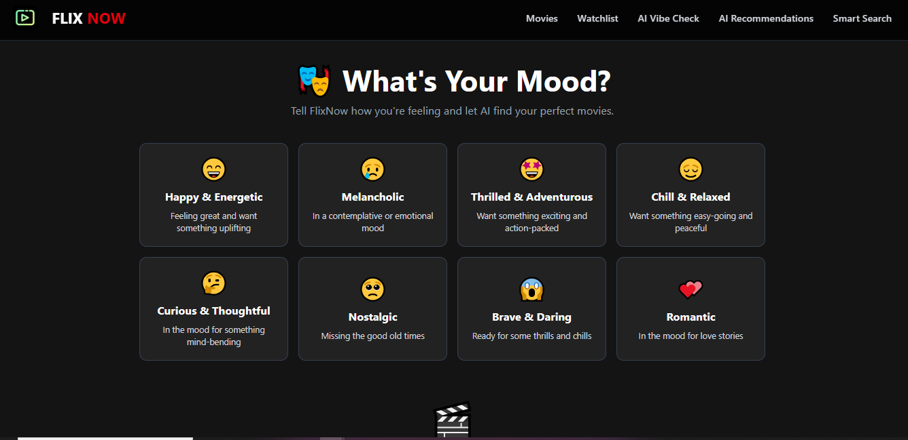
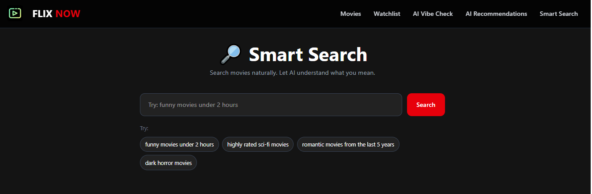

# 🎬 FlixNow — AI-Powered Movie Discovery Platform

<p align="center">
  
</p>

<h3 align="center">
  🎥 Discover Movies. 🤖 Get AI Recommendations. 🍿 Find Your Next Favorite.
</h3>

<p align="center">
  An AI-powered movie discovery platform built with React, Tailwind CSS,
  TMDB API and Google Gemini.
</p>

---

## 🌟 Overview

**FlixNow** is an AI-powered movie discovery platform designed to make finding movies easier, smarter, and more personalized.

Users can browse trending and now-playing movies, explore detailed movie information, manage their watchlist, watch trailers, discover movies based on their mood, and use AI-powered features to understand and explore movies.

The application combines the **TMDB API** for movie data with **Google Gemini** for intelligent movie recommendations and analysis.

---

## ✨ Features

### 🎬 Movie Discovery

* 🔥 Trending movie banner
* 🎥 Now Playing movies
* 📄 Pagination
* 🖼️ Movie posters
* ⭐ Movie ratings
* 🔥 Movie popularity
* 🔎 Movie search
* 🎭 Genre-based discovery
* ⏱️ Runtime-based movie filtering
* 🎯 Smart movie discovery

---

### 🎭 Mood-Based Movie Discovery

Tell FlixNow how you're feeling and discover movies that match your mood.

Available moods include:

* 😄 Happy & Energetic
* 😢 Melancholic
* 🤩 Thrilled & Adventurous
* 😌 Chill & Relaxed
* 🤔 Curious & Thoughtful
* 🥺 Nostalgic
* 😱 Brave & Daring
* 💕 Romantic

The AI analyzes the selected mood and recommends movies based on:

* 🎭 Genres
* 🧠 Mood keywords
* 💭 Emotional tone
* 🎬 Movie themes

---

### 🤖 AI Movie Recommendations

FlixNow can analyze movies in the user's watchlist and generate personalized recommendations.

The AI provides:

* 🎬 Recommended movie
* 💡 Reason for recommendation
* 📊 Confidence score
* 🧠 User taste summary

---

### 🔎 Smart Search

FlixNow provides intelligent movie discovery using customizable filters.

Users can discover movies based on:

* 🎭 Genre
* ⭐ Rating
* 🔥 Popularity
* ⏱️ Runtime
* 📅 Release information
* 🎯 Sorting preferences

This makes it easier to find movies that match specific preferences.

---

### 📝 AI Movie Summary

Users can generate a concise AI-powered summary of a movie.

The AI analyzes movie information and provides:

* 📝 Quick summary
* 🎯 Main themes
* 🍿 Why you might enjoy the movie

---

### 😱 AI Climax & Ending Explanation

Want to know how the movie ends?

FlixNow provides an optional AI-powered spoiler feature.

Users must explicitly confirm before viewing spoilers.

The feature provides:

* 🔥 Climax explanation
* 🎬 Ending explanation
* 💡 Ending meaning
* ⚠️ Spoiler warning

> 🚨 **Spoilers are shown only after user confirmation.**

---

### 🎞️ Movie Details

Each movie has a dedicated details page containing:

* 🎬 Movie title
* 📝 Overview
* ⭐ Rating
* 🔥 Popularity
* 📅 Release date
* ⏱️ Runtime
* 🎭 Genres
* ▶️ Trailer
* 👥 Cast
* 🎥 Crew
* 🎞️ Similar movies
* ⭐ Best review
* 🤖 AI summary
* 😱 AI climax explanation

---

### ▶️ Movie Trailers

Users can watch movie trailers directly inside FlixNow.

Trailer data is retrieved using TMDB and displayed through YouTube.

Features include:

* ▶️ Trailer playback
* 🖥️ Full-screen support
* ❌ Closeable trailer modal
* 🎬 Movie-specific trailer

---

### 👥 Cast & Crew

Movie details include information about the people involved in the movie.

Users can explore:

* 👤 Actors
* 🎬 Directors
* ✍️ Writers
* 🎥 Crew members

---

### ⭐ Best Review

FlixNow retrieves movie reviews and identifies a highly rated review.

The feature considers:

* ⭐ Review rating
* 📝 Review content
* 👤 Reviewer

Users can quickly access a highlighted review without manually searching through all available reviews.

---

### 🔖 Watchlist

Users can create their own personal movie watchlist.

Features include:

* ➕ Add movie
* ❌ Remove movie
* 🔍 Search watchlist
* 🎭 Filter by genre
* ⭐ Sort by rating
* 🔥 Sort by popularity
* 💾 Persistent storage using LocalStorage

The watchlist remains available even after refreshing the browser.

---

# 🧠 AI Features

FlixNow uses **Google Gemini** to provide intelligent movie experiences.

| Feature                      | Purpose                        |
| ---------------------------- | ------------------------------ |
| 🎭 Mood Picker               | Recommend movies based on mood |
| 🤖 Watchlist Recommendations | Learn user's movie taste       |
| 📝 AI Summary                | Generate movie summaries       |
| 😱 AI Climax                 | Explain climax and ending      |
| 🔎 Smart Search              | Intelligent movie discovery    |

---

# 🛠️ Tech Stack

## 🎨 Frontend

* ⚛️ React
* 🟨 JavaScript
* 🎨 Tailwind CSS
* 🧭 React Router
* 📡 Axios
* ⚡ Vite

## 🎬 Movie Data

**TMDB API**

Used for:

* Movie discovery
* Movie search
* Movie details
* Trending movies
* Now Playing movies
* Movie videos
* Cast & crew
* Similar movies
* Reviews

## 🤖 Artificial Intelligence

**Google Gemini API**

Used for:

* Mood-based recommendations
* Personalized recommendations
* AI movie summaries
* Climax and ending explanations

## 💾 Storage

**Browser LocalStorage**

Used to persist the user's watchlist locally.

---

# 📁 Project Structure

```text
FlixNow/
│
├── public/
│
├── src/
│   │
│   ├── assets/
│   │   └── logo.png
│   │
│   ├── Components/
│   │   ├── Banner.jsx
│   │   ├── Moviecard.jsx
│   │   ├── Movies.jsx
│   │   ├── MovieDetails.jsx
│   │   ├── Watchlist.jsx
│   │   ├── Navbar.jsx
│   │   ├── MoodSelector.jsx
│   │   ├── MovieRecommendations.jsx
│   │   ├── SmartSearch.jsx
│   │   ├── Pagination.jsx
│   │   └── Moviecontext.jsx
│   │
│   ├── services/
│   │   ├── tmdb.js
│   │   └── gemini.js
│   │
│   ├── utility/
│   │   ├── moods.js
│   │   └── genreid.js
│   │
│   ├── App.jsx
│   ├── main.jsx
│   └── index.css
│
├── .env
├── .gitignore
├── package.json
├── vite.config.js
└── README.md
```

---

# 🚀 Getting Started

Follow these steps to run FlixNow locally.

## 1️⃣ Clone the Repository

```bash
git clone https://github.com/KeerthyHQ/FlixNow-AI-powered-movie-discovery-platform.git
```

Navigate into the project:

```bash
cd FlixNow-AI-powered-movie-discovery-platform
```

---

## 2️⃣ Install Dependencies

Install all required npm packages:

```bash
npm install
```

---

## 3️⃣ Get Your API Keys

FlixNow requires two APIs:

### 🎬 TMDB API

Create a TMDB account and generate an API key from the TMDB developer dashboard.

You need the API key for retrieving movie information.

### 🤖 Google Gemini API

Create a Gemini API key from Google AI Studio.

The Gemini API is used for the AI-powered movie features.

---

## 4️⃣ Configure Environment Variables

Create a `.env` file in the root directory:

```env
VITE_TMDB_API_KEY=your_tmdb_api_key
VITE_GEMINI_API_KEY=your_gemini_api_key
```

Replace the placeholder values with your actual API keys.

> ⚠️ **Important:** Never commit your `.env` file to GitHub.

Make sure `.gitignore` contains:

```text
node_modules/
.env
dist/
```

---

## 5️⃣ Start the Development Server

Run:

```bash
npm run dev
```

Vite will start the development server.

Open the URL shown in your terminal, usually:

```text
http://localhost:5173
```

🎉 **FlixNow is now running !**

---

# 🎯 How to Use FlixNow

### 🔎 Discover Movies

Browse trending and currently playing movies from the home page.

### 🔍 Search

Use the search functionality to find movies by title.

### 🎭 Explore by Mood

Select a mood and let AI recommend movies that match your current feeling.

### 🧠 Use Smart Search

Apply filters such as genre, rating, popularity, runtime, and sorting preferences.

### 🎬 Explore Movie Details

Select any movie to view:

* Movie information
* Rating
* Genres
* Runtime
* Cast
* Crew
* Reviews
* Similar movies
* Trailer

### 🤖 Generate AI Summary

Use the AI summary feature to get a quick explanation of the movie.

### 😱 Explore the Ending

If you want spoilers, confirm the spoiler warning to reveal the AI-generated climax and ending explanation.

### 🔖 Build Your Watchlist

Add movies you want to watch later.

Your watchlist is stored in **LocalStorage**, so it remains available after refreshing the page.

### 🤖 Get Personalized Recommendations

Add movies to your watchlist and use the AI recommendation feature to discover movies based on your movie taste.

---

# 🔐 Environment Variables

| Variable              | Description                         |
| --------------------- | ----------------------------------- |
| `VITE_TMDB_API_KEY`   | API key used to access TMDB         |
| `VITE_GEMINI_API_KEY` | API key used for Gemini AI features |

> 🔒 Keep API keys private and never upload your `.env` file to GitHub.

---

# 📦 Available Scripts

Run these commands from the project directory:

| Command           | Description              |
| ----------------- | ------------------------ |
| `npm install`     | Install dependencies     |
| `npm run dev`     | Start development server |
| `npm run build`   | Create production build  |
| `npm run preview` | Preview production build |

---

# 🌐 Deployment

FlixNow can be deployed using platforms such as:

* ▲ Vercel
* 🌐 Netlify
* 🟪 Render
* 🟦 GitHub Pages

For deployment, make sure the required environment variables are configured in the hosting platform.

---

# 🔒 Security Notes

This project uses Vite environment variables.

Remember:

> ⚠️ Variables prefixed with `VITE_` are exposed to the client-side application.

Therefore, API keys used in a frontend-only project should be treated as publicly accessible.

For a production application, sensitive API operations should ideally be handled through a backend/server-side proxy.

---

# 🚧 Future Improvements

Some potential improvements for future versions include:

* 🔐 User authentication
* ☁️ Cloud-based watchlist
* 👤 User profiles
* ❤️ Personalized movie preferences
* 🧠 More advanced AI recommendations
* 🎯 AI-powered movie search
* 💬 AI movie chatbot
* 📊 Movie recommendation history
* 🌙 Dark/light theme customization
* 📱 Improved mobile responsiveness
* 🔔 Personalized movie notifications
* 🎬 Streaming platform availability
* 🌍 Multi-language support

---

# 💡 What I Learned

Building FlixNow helped me strengthen my understanding of:

* ⚛️ React component architecture
* 🪝 React Hooks
* 🧠 State management
* 🔄 API integration
* 📡 Axios
* 🧭 React Router
* 🎨 Tailwind CSS
* 🔐 Environment variables
* 💾 LocalStorage
* 🤖 Generative AI integration
* 🎬 TMDB API
* 🔎 Search and filtering
* 📄 Pagination
* 🧩 Reusable components
* ⚡ Asynchronous JavaScript
* 🚀 Vite and frontend deployment

---

# 🏆 Project Highlights

### ⭐ AI-Powered Movie Discovery

Instead of relying only on traditional filters, FlixNow uses AI to provide personalized movie discovery.

### 🎭 Mood-Based Recommendations

Users can discover movies based on how they feel rather than only searching by genre.

### 🤖 Personalized Watchlist Recommendations

The application analyzes the user's watchlist to understand their movie preferences.

### 😱 Spoiler-Controlled AI Ending

The climax and ending explanation is protected behind an explicit spoiler confirmation.

### 🎬 Complete Movie Experience

FlixNow combines movie discovery, trailers, reviews, cast, crew, similar movies, watchlists, and AI features into one platform.

---

# 📸 Screenshots

```text
screenshots/
├── home.png
├── movie-details.png
├── mood-selector.png
├── smart-search.png
├── watchlist.png
└── ai-recommendations.png
```


### Home



---
### Movie Details



---

### watchlist



---

### Mood Selector


---

### smart search




---

### AI Recommendations


---

# 🙌 Contributing

Contributions, suggestions, and improvements are welcome!

1. Fork the repository
2. Create a new branch

```bash
git checkout -b feature/your-feature
```

3. Make your changes
4. Commit your changes

```bash
git add .
git commit -m "Add new feature"
```

5. Push the branch

```bash
git push origin feature/your-feature
```

6. Open a Pull Request

---

# 📄 License

This project is created for educational and portfolio purposes.

Movie data is provided by **TMDB**.

---

# 👩‍💻 Author

### Keerthika M

💻 Full Stack Developer | React Developer | AI Enthusiast

### 🔗 Connect With Me

* 💼 https://www.linkedin.com/in/keerthika-m-3b51b9127/
* 🐙 https://github.com/KeerthyHQ
* 📧 mailto:keerthy.builds@gmail.com

---

<p align="center">

### 🎬 Made with ❤️ using React, TMDB & Google Gemini

⭐ If you found FlixNow interesting, consider giving the repository a star!

</p>
